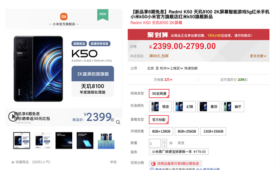
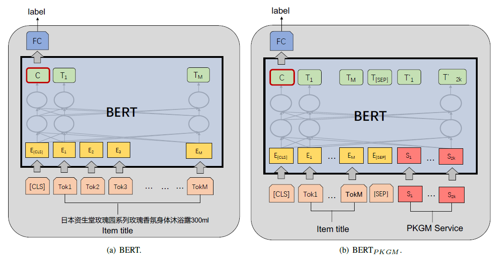
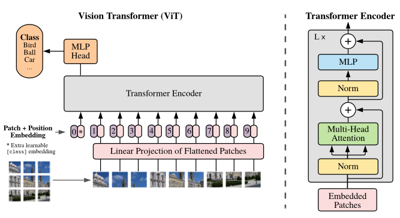
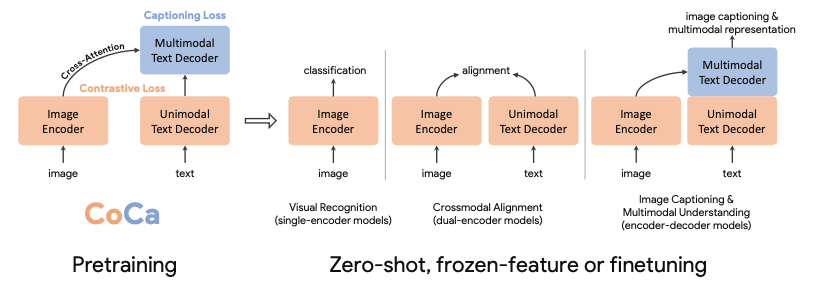
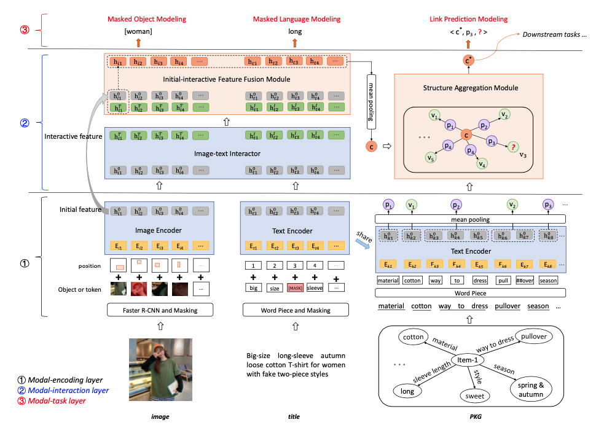
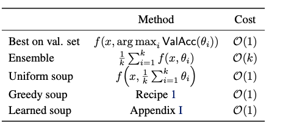
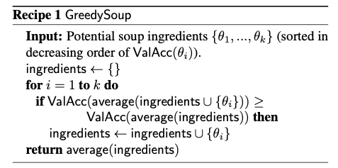

# CCKS2022-任务9-子任务2：基于知识图谱的商品同款挖掘

[比赛地址](https://tianchi.aliyun.com/competition/entrance/531956/introduction)

# 1. 任务描述
同款商品是指商品的重要属性完全相同且客观可比的商品，商品同款识别的主要目的是从海量结构化和无结构化的商品图文数据库中匹配得到同款商品，是构建电商产品关系的一个重要环节。商品同款作为商品知识图谱的重要组成部分，有很多应用场景，如同款商品发现等。
商品定义： 商品（即item）通常由多个sku构成，其基础信息包括item级信息（主图、标题、类目、属性及属性值）以及sku级信息（sku图片、sku销售属性），例如：Redmi K50 是一个item（见图1），（Redmi K50，银迹，8GB+128GB）是一个sku。从消费者视角出发，对于手机类目，品牌+型号一致的商品可以认定是同款商品

<div align=center>
</div>

但由于商家个性化发布导致商品标准化、结构化程度差，且不同类目下的商品关注的重要属性不一，给细粒度同款对齐带来了困难。且考虑到电商平台商品量级大，现有方法通常基于表示学习的方法，基于商品的基础信息得到商品的向量表示，在此基础上基于向量检索的方式，得到item同款。本任务聚焦于item同款，并为了简化问题，我们将商品同款识别任务定义为二分类任务，即给定商品对信息，判断是否item同款。


# 2. 任务目标
针对item同款挖掘，要求参赛选手基于表示学习建模。即对给定的商品对，学习得到商品embedding表征，计算商品对的相似度，基于阈值判断是否是同款商品，返回结果标签，1表示是同款，0表示不是同款。 为了公平起见，商品embedding统一维度<=1024。基于表示学习建模的方式可在面向亿级别商品的真实业务场景高效地发现同款商品。

**PS**：本repo的方法一部分基于表示学习，计算每个item的embedding，另一部分基于商品对直接计算得分


# 3. 数据集介绍
在初赛阶段训练集和验证集发布阶段，我们会发布50000条左右的item同款对数据作为训练集。训练集由三部分构成，可以在天池平台下载获取。

- 下载地址：
~~~
链接: https://pan.baidu.com/s/16nHd6MkB-xZV8RVEZjYDfw 
提取码: vt87
~~~

- item_train_info.jsonl：item的基础信息文件，每行是一个json串，具体字段内容如表所示

| 字段	| 说明 |
| --- | ----------- |
| item_id |	item（商品）唯一id |
| industry_name	| 商品所属的行业组 |
| cate_id	| 商品所属的类目id |
| cate_name	| 商品所属的类目名称 |
| cate_id_path	| 商品所属的类目路径id |
| cate_name_path	| 商品所属的类目路径名称 |
| item_image_name	| 商品的主图文件名 |
| title	| 商品标题 |
| item_pvs	| 商品的属性及其属性值 |
| sku_pvs	| sku的销售属性及其属性值 |

- item_train_pair.jsonl：是商品item同款对文件，每行是一个json串，表示一个同款对标注信息。

| 字段	| 说明 |
| --- | -------- |
| src_item_id	| 源商品的item_id |
| tgt_item_id	| 目标商品的item_id |
| item_label	| src_item_id和tgt_item_id是否是item同款 |

- item_train_images.zip.parta[a-z]是训练集商品item图片文件，可通过item_image_name字段从文件夹中获取到对应的item图片。由于整个图片文件过大，我们切成了若干份。


# 4. 评测指标 
本次任务采用精确率（Precision）、召回率（Recall）、F1值（F1-measure）来评估同款商品挖掘的效果。精确率为在被所有预测为正的样本中实际为正样本的概率。召回率为在实际为正的样本中被预测为正样本的概率。

# 5. 模型介绍
采用4类模态的模型对商品同款问题进行建模：a. 文本 b. 图像 c. 图谱 d. 多模态。最终对各个模态的模型进行model ensemble

对于商品对同款判别模型，结构上有以下4个参数可进行配置：
- 交互方式(interaction type): 双塔(two tower)、单塔(one tower)
- 分类方法(classification method): matrix projection(将2个商品的embedding或商品对embedding通过矩阵映射为2维向量，然后计算logits), vector similarity(计算2个商品的embedding向量，然后计算向量相似度)
- 向量相似度度量(similarity measure): softmax, cosine, inner product, l1, l2
- 损失函数(loss type): cross entropy loss, binary cross entropy loss, cosine embedding loss, hinge loss, euclidean loss


## 5.1 文本模型
### 5.1.1 TextCNN
基于TextCNN模型对数据中的title、item_pvs、sku_pvs这3个文本字段进行建模，将每个商品的title和pv信息拼接为一条文本，通过TextCNN计算文本embedding，最后计算2个商品embedding的相似度。

训练代码：
```bash
# 训练数据准备
python data_prepare.py \
  --data_dir $DATA_DIR \
  --output_dir $OUTPUT_DIR
  
# TextCNN模型训练
python finetune_text.py \
  --data_dir $DATA_DIR \
  --output_dir $OUTPUT_DIR \
  --model_name "textcnn" \
  --data_version "v1" \
  --pretrained_model_path $PRETRAINED_MODEL_PATH \
  --config_file "roberta_base.json" \
  --do_train \
  --do_eval \
  --interaction_type "two_tower" \
  --classification_method "cls" \
  --similarity_measure "NA" \
  --loss_type "ce" \
  --max_seq_len 50 \
  --max_seq_len_pv 205 \
  --fp16
```

### 5.1.2 RoBerta
基于roberta模型对数据中的title、item_pvs、sku_pvs这3个文本字段进行建模，将商品对的title和pv信息拼接为一条文本，格式如下：

~~~
[CLS] src_title [SEP] src_pvs [BOS] tgt_title [SEP] tgt_pvs [SEP]
~~~

训练代码：
```bash
# 训练数据准备
python data_prepare.py \
  --data_dir $DATA_DIR \
  --output_dir $OUTPUT_DIR
  
# roberta模型训练
python finetune_text.py \
  --data_dir $DATA_DIR \
  --output_dir $OUTPUT_DIR \
  --model_name "roberta_large" \
  --data_version "v1" \
  --pretrained_model_path $PRETRAINED_MODEL_PATH \
  --config_file "roberta_large.json" \
  --do_train \
  --do_eval \
  --interaction_type "one_tower" \
  --classification_method "cls" \
  --similarity_measure "NA" \
  --loss_type "ce" \
  --max_seq_len 50 \
  --max_seq_len_pv 205 \
  --fp16
```

### 5.1.3 PKGM
Implementation of pretrained knowledge graph model
**PKGM**, which is model proposed in a paper: **[Billion-scale Pre-trained E-commerce Product
Knowledge Graph Model](https://arxiv.org/abs/2105.00388)**.

<div align=center>
</div>

训练代码：
```bash
# 训练数据准备
python data_prepare.py \
  --data_dir $DATA_DIR \
  --output_dir $OUTPUT_DIR

# PKGM预训练
python pkgm_pretrain.py \
  --data_dir $DATA_DIR \
  --output_dir $OUTPUT_DIR \
  --model_name "pkgm_epoch-{}.bin"
  
# PKGM finetune
python finetune_text.py \
  --data_dir $DATA_DIR \
  --output_dir $OUTPUT_DIR \
  --model_name "pkgm_large" \
  --data_version "v1" \
  --pretrained_model_path $PRETRAINED_MODEL_PATH \
  --config_file "pkgm_large.json" \
  --do_train \
  --do_eval \
  --interaction_type "one_tower" \
  --classification_method "cls" \
  --similarity_measure "NA" \
  --loss_type "ce" \
  --max_seq_len 50 \
  --max_pvs 30 \
  --fp16
```

## 5.2 图像模型
基于cv模型对商品对的图片进行建模。目前图像模型均为双塔(two tower)结构，即商品对两张图片分别计算image embedding，然后再计算向量相似度。

### 5.2.1 ResNetV2
[ResNetV2](https://paperswithcode.com/method/inception-resnet-v2) 作为图像baseline模型

训练代码：
```bash
# 训练数据准备
python data_prepare.py \
  --data_dir $DATA_DIR \
  --output_dir $OUTPUT_DIR \
  --only_image \
  --image_size 800
    
# ResNetV2模型训练
python finetune_image.py \
  --data_dir $DATA_DIR \
  --output_dir $OUTPUT_DIR \
  --model_name "resnetv2_50" \
  --data_version "v1" \
  --config_file "resnetv2_50.json" \
  --do_train \
  --do_eval \
  --image_size 800 \
  --fp16
```

### 5.2.2 ECA-Net
[ECA-Net](https://paperswithcode.com/paper/eca-net-efficient-channel-attention-for-deep) 通过在CNN中加入Efficient Channel Attention (ECA)，对不同channel的交互进行建模，同时无需进行降维。

训练代码：
```bash
# 训练数据准备
python data_prepare.py \
  --data_dir $DATA_DIR \
  --output_dir $OUTPUT_DIR \
  --only_image \
  --image_size 800
    
# ECA-Net模型训练
python finetune_image.py \
  --data_dir $DATA_DIR \
  --output_dir $OUTPUT_DIR \
  --model_name "eca_nfnet_l0" \
  --data_version "v1" \
  --config_file "eca_nfnet_l0.json" \
  --do_train \
  --do_eval \
  --image_size 800 \
  --fp16
```

### 5.2.3 ViT
[vision transformer](https://paperswithcode.com/paper/eca-net-efficient-channel-attention-for-deep) 通过将单张图片转换为sequence of patches，从而可以使用transformer模型对图片进行建模。

<div align=center>
</div>

训练代码：
```bash
# 训练数据准备
python data_prepare.py \
  --data_dir $DATA_DIR \
  --output_dir $OUTPUT_DIR \
  --only_image \
  --image_size 384
    
# ViT模型训练
python finetune_image.py \
  --data_dir $DATA_DIR \
  --output_dir $OUTPUT_DIR \
  --model_name "vit_large_patch16_384" \
  --data_version "v1" \
  --config_file "vit_large_patch16_384.json" \
  --do_train \
  --do_eval \
  --image_size 384 \
  --fp16
```


## 5.3 图谱模型
由于数据中有item_pvs和sku_pvs 2个字段，因此可构建为图数据，其中结点为商品、属性值，边为属性名称。基于图模型可计算node embedding，然后通过比较embedding相似度即可判断同款。图谱模型也均为双塔(two tower)结构。
### 5.3.1 GCN
GCN通过有监督或无监督进行训练。本repo采用有监督的训练方式，监督值即为是否同款（因此训练没有覆盖全部结点，只对商品结点进行训练）

其中，feature matrix的定义：商品结点的feature为title的text embedding (768维)，属性值结点的feature为属性值的text embedding (768维)

训练代码：
```bash
# 训练数据准备
python data_prepare.py \
  --data_dir $DATA_DIR \
  --output_dir $OUTPUT_DIR
  
# GCN模型训练
python finetune_graph.py \
  --data_dir $DATA_DIR \
  --output_dir $OUTPUT_DIR \
  --model_name "gcn" \
  --data_version "v1" \
  --pretrained_model_path $PRETRAINED_MODEL_PATH \
  --config_file "gcn.json" \
  --do_train \
  --do_eval \
  --interaction_type "two_tower" \
  --classification_method "cls" \
  --similarity_measure "NA" \
  --loss_type "ce"
```

## 5.4 多模态模型
### 5.4.1 roberta + image embedding
与roberta模型整体结构一致，在输入文本增加[IMG_TOKEN]：
~~~
[CLS] [IMG_TOKEN] [SEP] src_title [SEP] src_pvs [BOS] [IMG_TOKEN] [SEP] tgt_title [SEP] tgt_pvs [SEP]
~~~

通过eca_nfnet_l1计算得到image embedding (3072维)，然后映射为768/1024维的向量，作为[IMG_TOKEN]位置对应的embedding。

训练代码：
```bash
# 训练数据准备
python data_prepare.py \
  --data_dir $DATA_DIR \
  --output_dir $OUTPUT_DIR \
  --with_image \
  --cv_model_name "eca_nfnet_l1" \
  --image_size 800 \
  --batch_size 256
  
# roberta+image模型训练
python finetune_multimodal.py \
  --data_dir $DATA_DIR \
  --output_dir $OUTPUT_DIR \
  --model_name "roberta_image_large" \
  --data_version "v1" \
  --pretrained_model_path $PRETRAINED_MODEL_PATH \
  --config_file "roberta_image_large.json" \
  --do_train \
  --do_eval \
  --interaction_type "one_tower" \
  --classification_method "cls" \
  --ensemble "begin" \
  --loss_type "ce"
```

### 5.4.2 CoCa
[CoCa](https://paperswithcode.com/paper/coca-contrastive-captioners-are-image-text) 通过image encoder和text decoder分别对图像和文本提取embedding，然后cross attention计算多模态embedding，最终计算2个商品的多模态embedding相似度判断是否同款。因此CoCa也是双塔(two tower)结构。 

<div align=center>
</div>

训练代码：
```bash
# 训练数据准备
python data_prepare.py \
  --data_dir $DATA_DIR \
  --output_dir $OUTPUT_DIR
  
# coca模型训练
python finetune_multimodal.py \
  --data_dir $DATA_DIR \
  --output_dir $OUTPUT_DIR \
  --model_name "coca_large" \
  --data_version "v1" \
  --pretrained_model_path $PRETRAINED_MODEL_PATH \
  --config_file "coca_large.json" \
  --image_model_name "vit_large_patch16_384" \
  --do_train \
  --do_eval \
  --interaction_type "two_tower" \
  --classification_method "cls" \
  --ensemble "sum" \
  --loss_type "ce"
```

### 5.4.3 K3M
[K3M](https://arxiv.org/abs/2109.00895) 通过对图像、文本、图谱3类模态进行预训练，然后可针对item alignment任务进行finetune。 

<div align=center>
</div>

具体代码见: https://github.com/sunzeyeah/K3M 

## 5.5 Model Ensemble
通过对上述4类模型进行融合，可进一步提升模型效果。具体融合策略可分为以下3类：

### 5.5.1 [threshold-based](https://www.kaggle.com/c/shopee-product-matching/discussion/238022)
  1. 计算每个单模型的最优阈值
  2. 每个模型的预测值减去其对应的阈值，得到新的预测值
  3. 将全部模型的新预测值相加得到最终的预测值
  4. 如果相加后的最终预测值 > 0，则预测为1；否则预测为0

```bash
python model_ensemble.py \
  --data_dir $DATA_DIR \
  --ensemble_strategy "threshold" \
  --split_by_valid_or_test
```

### 5.5.2 f1-based 
  1. 计算各个单模型的最优f1
  2. 对每个sample，令score_0和score_1表示预测为0和1的得分。遍历所有候选模型，如果该模型预测为0，score_0加上该模型的f1；否则，score_1加上该模型的f1
  3. 每个sample的预测结果可计算为：如果score_0 > score_1，则预测为0；否则为1

```bash
python model_ensemble.py \
  --data_dir $DATA_DIR \
  --ensemble_strategy "f1" \
  --split_by_valid_or_test
```

### 5.5.3 [model soup](https://paperswithcode.com/paper/model-soups-averaging-weights-of-multiple) 
对单个模型（如：roberta）使用不同的超参（包括: 随机种子、学习率、dropout等）进行训练，然后将不同超参的模型参数进行融合，可进一步提升单模型的效果。

<div align=center>
</div>

<div align=center>
</div>

```bash
# model soup on text models
bash run_model_soup_text.sh

# model soup on multimodal models
bash run_model_soup_multimodal.sh
```

## 5.6 优化历史
以下为验证集结果：
- baseline：roberta_base-v1, threshold=0.4, f1=**0.8399**
- 扩展数据集(输入加上item_pvs和sku_pvs)：roberta_base-v2, threshold=0.3, f1=**0.8483**
- 构造数据集(按照品类内的出现频率由高到低确定pv的文本位置)：roberta_base-v3, threshold=0.4, f1=**0.8512**
- 对齐数据集(商品对相同的pv放在前，不同的pv放在后)：roberta_base-v3.4, threshold=0.4, f1=**0.8550**
- 换用更大模型：roberta_large-v3.4, threshold=0.3, f1=**0.8605**
- threshold-based模型融合(roberta and roberta+image)：threshold=0.0, f1=**0.8662**
- 更多模型融合：threshold=0.0, f1=**0.8772**
- 融合时，根据该品类是否出现在训练集，采用不同阈值：threshold=0.0, f1=**0.8788**

最终在测试集（复赛）中，f1=**0.8800**，排名第4

### 无效尝试
- 交互方式：**双塔(two tower)** 均明显差于 **单塔(one tower)**，双塔的最优f1只能在0.80左右
- 分类方法：**matrix projection** 优于 **vector similarity**，不管使用何种相似度度量方法
- 文本模型：数据增强，**使用训练好的模型对验证集进行预测**，预测后的结果加入训练集
- 文本模型：将pv对按照**相对重要性**进行排序（非频率）
- 文本模型：增加辅助任务，**对商品对中相同的属性key，判断其属性value是否相同**
- 文本模型：增加**品类embedding**
- 文本模型：输入文本中加入**品类(cate_name)** 和 **行业(industry_name)**
- 文本模型：对**属性值进行标准化**，如：不同值代表相同含义（xl和大码）则使用统一值
- 文本模型：数据增强，增加**easy负样本**（即不同品类的商品对）
- 文本模型：换用**不同的roberta预训练模型文件**，如：roberta_large_pair、macbert_large
- 文本模型：增大max_position_embeddings，训练**更长的sequence**
- 文本模型：训练**更多的epoch**(超过10个)
- 文本模型：将**最后4层的cls输出concat**起来作为新的cls output
- 多模态模型：roberta+image使用基于商品同款**finetune后**的图像模型生成image embedding
- 多模态模型：roberta+image在**输出层**将cls embedding和image embedding concat然后matrix projection算logits
- 多模态模型：k3m效果一般且代码复杂，预训练时三元组和图像loss的不降低；最终finetune后的f1=0.7635
- 图像模型：先对原始图片进行**object detection**，使用框出有效商品后的图片训练模型
- 图像模型：针对**每个品类训练单独**的图像模型
- 模型融合：基于**uniform soup**的model soup
- 模型融合：**f1-based** 一般差于 **threshold-based**，且模型数量越多召回结果越少

**PS**：上述“无效优化”指对单模型的效果无提升，各种尝试后的模型虽然效果不如最优单模型，但可以用在model ensemble中，继续提升整体效果。


## 5.7 复现结果

- 硬件要求：单机单卡，显存≥80G，内存≥90G
- 运行时长：训练 (train.sh) 58h左右，预测 (predict.sh) < 8h
- 复现代码：
```bash
docker pull sunzeyeah/python:ccks2022_task9_subtask2 

# 镜像中不包含图片数据，因此需要本地挂载图片数据至镜像
# IMAGE_DIR为图片地址，格式为***/item_images，包括train,valid,test的所有图片
# OUTPUT_DIR为模型文件和预测结果的保存地址
docker run --rm --gpus 0 -v ${IMAGE_DIR}:/root/Data/raw/item_images -v ${OUTPUT_DIR}:/root/Data/output sunzeyeah/python:ccks2022_task9_subtask2 /bin/bash -c "cd /root/Code/item-alignment; bash train.sh; bash predict.sh"

```